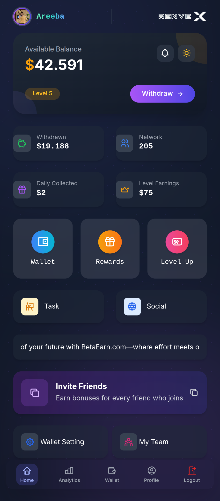
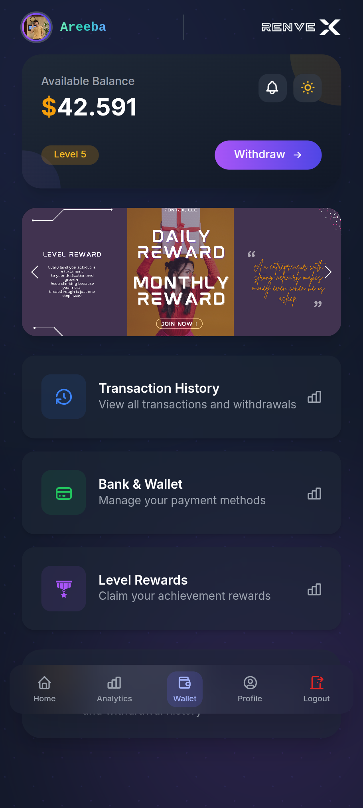
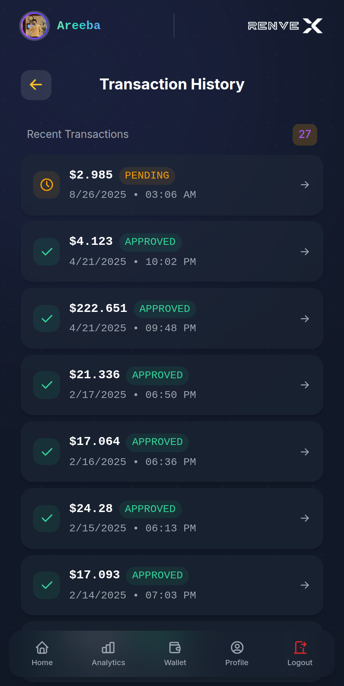
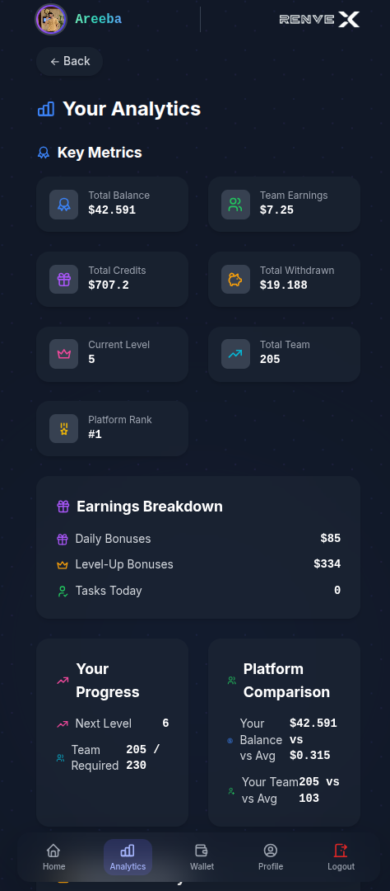

# RenvexROI App

A modern ROI tracking and withdrawal management app with secure authentication, smooth UI, and responsive design.

---

## Features

### 🔐 Authentication

* Secure user login and session management
* Credential-based authentication with cookie handling

### 💰 Withdrawal Management

* Request new withdrawals with bank details
* Real-time withdrawal status tracking (Approved / Pending / Rejected)
* Detailed transaction history with timestamps

### 📱 Responsive Design

* Mobile-first approach with adaptive layouts
* Dark/light mode toggle for user preference
* Touch-friendly interface optimized for all devices

### 📄 Receipt System

* Printable transaction receipts
* Bank-style receipt design with typewriter aesthetics
* Secure field masking for sensitive information
* Copy transaction IDs with one click

### 🎨 UI/UX Highlights

* Smooth animations with Framer Motion
* Modern gradient backgrounds and glass-morphism effects
* Intuitive navigation with bottom bar and top navbar
* Contextual status indicators with color coding

---

## 📸 Screenshots

| Dashboard                                  | Home Card                            |
| ------------------------------------------ | ------------------------------------------ |
|  |  |

| Withdrawal List                    | Analytics Card                            |
| ---------------------------------- | ----------------------------------------- |
|  |  |
| *Withdrawal Request List*          | *Transaction History View*                |

---

## Tech Stack

### Frontend

* **React** – Component-based UI library
* **React Router** – Client-side routing
* **Framer Motion** – Smooth animations and transitions
* **Tailwind CSS** – Utility-first CSS framework
* **Axios** – HTTP client for API requests

### Icons

* **React Icons (Tabler Icons)** – Consistent iconography

### State Management

* **React Context API** – Global state for dark mode and user data

### Build Tools

* **Vite** – Fast development server and build tool
* **ESLint** – Code linting and formatting

---
